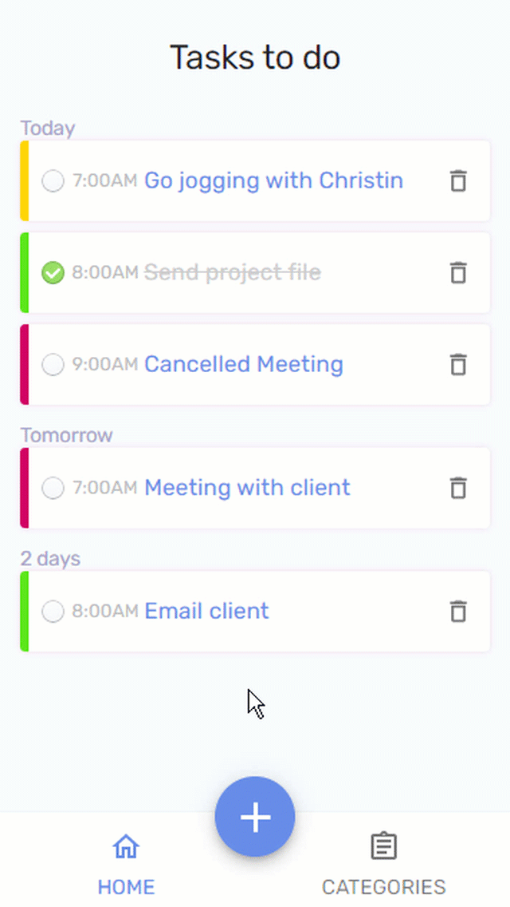
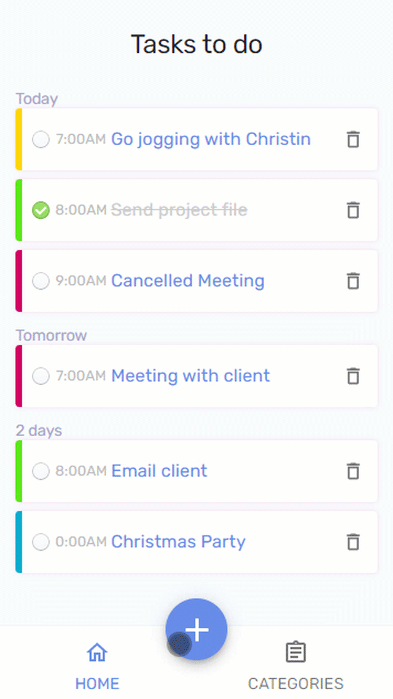

# TODO App 📃

The classic To-Do application where a user can write down all the things he wants to accomplish.

# Motivation

This idea came out from [App Ideas Collection](https://github.com/florinpop17/app-ideas)  
See the project description [here](./PROJECT_IDEA.md)

# Demos



# Tools
* [React](https://es.reactjs.org/) - Framework
* [Material UI](https://material-ui.com/) - For some UI components
* [Material Pickers](https://material-ui-pickers.dev/) - Date & Time pickers 
* [local-storage](https://www.npmjs.com/package/local-storage) - Easier local storage
* [wouter](https://www.npmjs.com/package/wouter) - Tiny router with hooks

# Deployment

This app is deployed on [Vercel](https://todo-tan.vercel.app/)

# To run this app
1. Clone this repo
2. Run ```npm install```
3. Run ```npm start```
